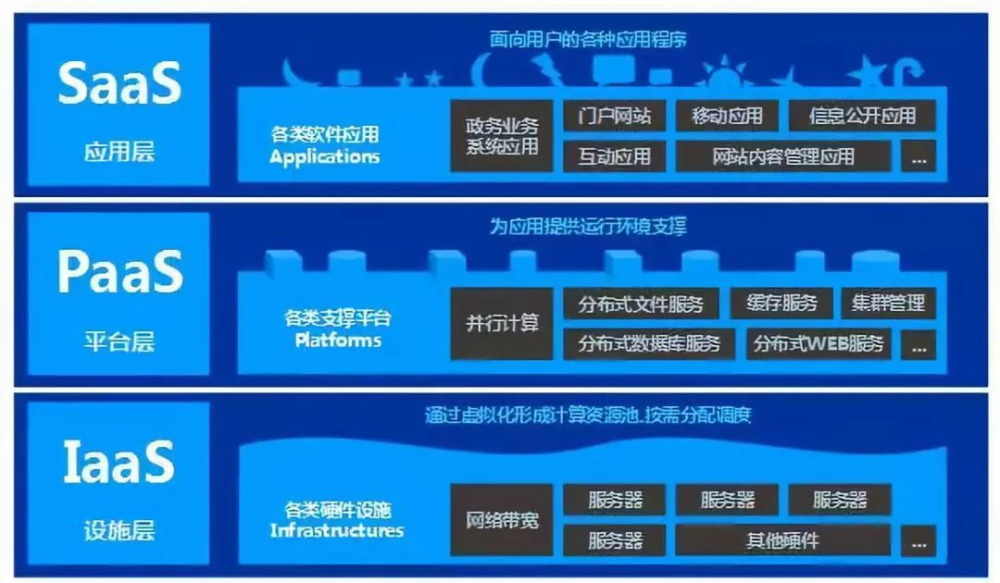

<!-- GFM-TOC -->
* [一、IaaS](#一IaaS)
* [二、PaaS](#二PaaS)
* [三、 SaaS](#三SaaS)
  <!-- GFM-TOC -->

云是一个非常广泛的概念，它涵盖了所有可能的在线服务，但是当企业参考云采购时，通常会考虑三种云服务模式，即基础架构即服务（laaS），平台即服务（PaaS）和软件即服（SaaS）。由于云系统自身的复杂性和混合模式的组合需要大量理论技巧，在不同应用场景下，也会存在各种具体的使用模式。

  
 

# 一、IaaS

（1）IaaS的概念

消费者通过Internet 可以从完善的计算机基础设施获得服务。

（2）IaaS的应用

提供给消费者的服务是对所有计算基础设施的利用，包括处理CPU、内存、存储、网络和其它基本的计算资源，用户能够部署和运行任意软件，包括操作系统和应用程序。消费者不管理或控制任何云计算基础设施，但能控制操作系统的选择、存储空间、部署的应用，也有可能获得有限制的网络组件（例如路由器、防火墙、[负载均衡](https://cloud.tencent.com/product/clb?from=10680)器等）的控制。

即laaS提供商通过仪表板或API提供这些[云服务器](https://cloud.tencent.com/product/cvm?from=10680)及其相关资源。laaS客户端可以直接访问其服务器和存储，就像传统服务器一样，但可以访问更高级别的扩展性。laaS的用户可以在云中外包和构建“虚拟数据中心”，并可以访问传统数据中心的许多享通的技术和资源功能，而无需投资与容量规划或物理维护和管理。

（3）IaaS的用途

laaS是最灵活的云计算模式，允许自动部署服务器，处理能力，存储和网络。laaS客户端对PaaS或SaaS服务的用户进行真正的控制。laaS的主要用途包括PaaS，SaaS和网络规模应用程序的实际开发和部署。

（4）IaaS的案例

几年前如果你想在办公室或者公司的网站上运行一些企业应用，你需要去买服务器，或者别的高昂的硬件来控制本地应用，让你的业务运行起来。但是现在有IaaS，你可以将硬件外包到别的地方去。IaaS公司会提供场外服务器，存储和网络硬件，你可以租用。节省了维护成本和办公场地，公司可以在任何时候利用这些硬件来运行其应用。

（5）IaaS的供应商

亚马逊网络服务公司：行业典范

CSC：瞄准大企业

IBM：利用现有客户群

Rackspace：扮演领导角色

Savvis：提供种类齐全的方案

Terremark：三管齐下的基于VMware的做法

VMware：关键的构建模块

一些大的IaaS公司包括Amazon, Microsoft, VMWare, Rackspace和Red Hat.不过这些公司又都有自己的专长，比如Amazon和微软给你提供的不只是IaaS，他们还会将其计算能力出租给你来host你的网站。

# 二、PaaS

（1）PaaS的概念

指将软件研发的平台作为一种服务，以SaaS的模式提交给用户。因此，PaaS也是SaaS模式的一种应用。但是，PaaS的出现可以加快SaaS的发展，尤其是加快SaaS应用的开发速度。

（2）PaaS的应用

PaaS公司在网上提供各种开发和分发应用的解决方案，比如虚拟服务器和操作系统。这节省了你在硬件上的费用，也让分散的工作室之间的合作变得更加容易。网页应用管理，应用设计，应用虚拟主机，存储，安全以及应用开发协作工具等。

如果一家企业承受着把应用程序软件迁移至网络或移动设备的压力，那么PaaS则具有明显的优势。企业业务进入市场的时间更短，这样也就避免了开发时间冗长、上市时间过长的产品开发过程。这样的产品必定是高质量的，同时也必须能够被快速提供。PaaS可让企业更专注于他们所开发和交付的应用程序，而不是管理和维护完整的平台系统。

对于小型企业和初创型企业来说，PaaS也是比较有用的，因为这些企业并没有广泛的、具有较高依赖性的旧应用程序需要迁移。PaaS的多租户特性可实现应用程序和数据资源的最大数量共享，同时让开发资源继续专注于应用程序的交付和连接，而不是开发和支持数据库资源。PaaS的未来发展空间似乎在小型企业和初创企业，这类公司由于不依赖于与旧应用程序的集成而更适于在云计算中进行应用程序开发

（3）PaaS的用途

PaaS提供者处理服务器的大部分工作，并为客户提供了操作系统和服务器软件以及底层服务器硬件和网络基础设施的环境，使用户可以自由地关注业务端可拓展性及其产品或服务的应用开发。与大多数云服务一样，PaaS是建立在虚拟化技术之上的。企业可以根据需要申请资源，随着需求的增长而不是以冗余资源投入硬件。

（4）PaaS的供应商

一些大的PaaS提供者有Google App Engine,Microsoft Azure，[Force.com,Heroku](http://force.com,heroku/)，Engine Yard。最近兴起的公司有AppFog, Mendix 和 Standing Cloud

# 三、 SaaS

（1）Saas的概念

它是一种通过Internet提供软件的模式，厂商将应用软件统一部署在自己的服务器上，客户可以根据自己实际需求，通过互联网向厂商定购所需的应用软件服务，按定购的服务多少和时间长短向厂商支付费用，并通过互联网获得厂商提供的服务。用户不用再购买软件，而改用向提供商租用基于Web的软件，来管理企业经营活动，且无需对软件进行维护，服务提供商会全权管理和维护软件，软件厂商在向客户提供互联网应用的同时，也提供软件的离线操作和本地数据存储，让用户随时随地都可以使用其定购的软件和服务。

（2）Saas的应用

在某些方面，SaaS非常类似于旧版客户端软件配置模式，其中客户端（在这种情况下通常是Web浏览器）提供对服务器上运行的软件的访问点。SaaS是消费者最熟悉的云服务形式。SaaS将管理软件及其部署的任务转移到第三方服务。最熟悉的业务SaaS应用程序是客户关系管理应用程序，如Saleforce，像Google Apps这样的生产力软件套件，以及Box和Dropbox等存储解决方案的。使用SaaS应用程序往往会降低软件所有权成本，因为不需要技术人员来管理软件的安装，管理和升级，同时降低许可软件的成本。通常在订阅模式上提供SaaS应用程序。

（3）Saas的分类

SaaS企业管理软件分成两大阵营：平台型SaaS和傻瓜式SaaS。

平台型SaaS是把传统企业管理软件的强大功能通过SaaS模式交付给客户，有强大的自定制功能。

一般而言，平台型SaaS更适合企业的发展，因为它强大的自定制功能能满足企业的应用，当然，并非所有SaaS厂商的产品都具有自定制功能，所以企业在选择产品时要先考察清楚。

傻瓜式SaaS提供固定功能和模块，简单易懂但不能灵活定制的在线应用，用户也是按月付费。

傻瓜式SaaS的功能是固定的，在某个阶段能适应企业的发展，一旦企业有了新的发展，它的无法升级和无自定制的缺点就会暴露出来，这时企业只能进行“二次购买”。平台型SaaS和傻瓜式SaaS的共同点是都能租赁使用。但是无论是平台型SaaS或傻瓜式SaaS，SaaS服务提供商都必须有自己的知识产权，所以企业在选择SaaS产品时应当了解服务商是否有自己的知识产权。

（4）Saas的用途

最早的SaaS服务之一是在线电子邮箱，极大地降低了个人与企业使用电子邮件的门槛，进而改变了人与人、企业与企业之间的沟通方式。发展至今，SaaS服务的种类与产品已经非常丰富，面向个人用户的服务包括：帐务管理、文件管理、照片管理、在线文档编辑、表格制作、资源整合、日程表管理、联系人管理等等;面向企业用户的服务包括：在线存储管理、网上会议、项目管理、CRM(客户关系管理)、ERP(企业资源管理)、HRM(人力资源管理)、STS(销售管理)、EOA(协调办公系统)、财务管理、在线广告管理以及针对特定行业和领域的应用服务等等。

（5）Saas的供应商

Saas服务软件，在不同行业都有相应的服务提供商。

比如CRM（客户关系管理软件）Saas服务提供商国际上比较有名的如Salesforce，国内也有800客等一些厂商；

协同OA,Saas服务提供商有够用协同办公平台，无缝整合OA,ERP,CRM,各种轻量办公,打造统一的办公入口,30秒注册即用

ERP（企业资源计划管理软件）、TMS（电话营销管理软件）等也有Saas服务提供商提供Saas模式的租用服务；

在呼叫中心（Call Center，也称为联络中心）领域也有Saas服务提供商，以租用的方式提供呼叫中心的运营服务。比如青牛、讯鸟、天润融通等一些公司。