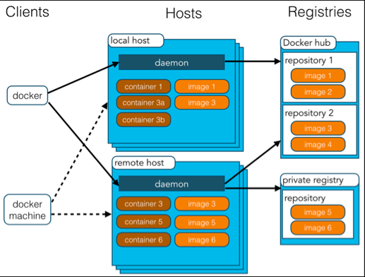
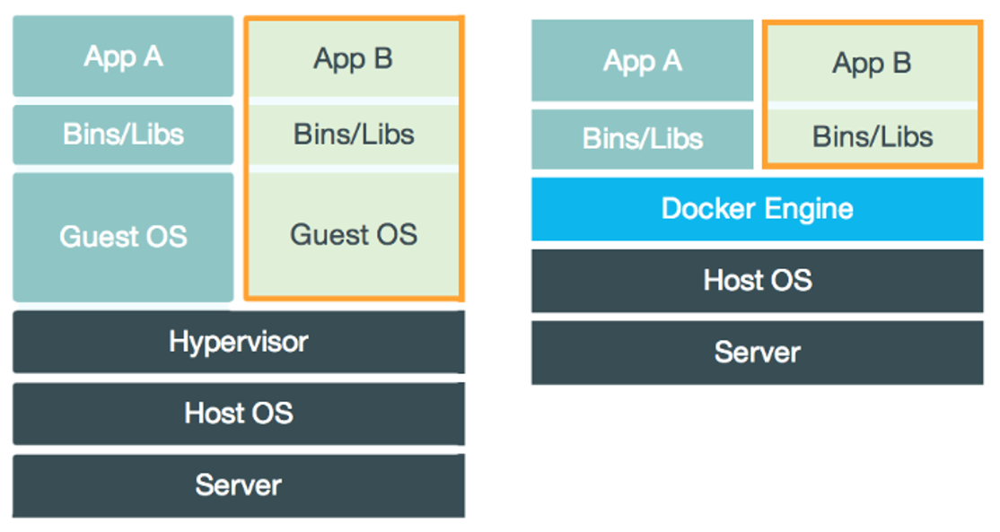

<!-- GFM-TOC -->
* [一、解决的问题](#一解决的问题)
* [二、Docker 核心技术](#二Docker 核心技术)
* [三、优势](#三优势)
* [四、使用场景](#四使用场景)
* [五、镜像与容器](#五镜像与容器)
* [参考资料](#参考资料)
<!-- GFM-TOC -->

# 一、解决的问题

由于不同的机器有不同的操作系统，以及不同的库和组件，在将一个应用部署到多台机器上需要进行大量的环境配置操作。

Docker 主要解决环境配置问题，它是一种虚拟化技术，对进程进行隔离，被隔离的进程独立于宿主操作系统和其它隔离的进程。使用 Docker 可以不修改应用程序代码，不需要开发人员学习特定环境下的技术，就能够将现有的应用程序部署在其它机器上。

  
 

# 二、Docker 核心技术

## 核心技术

Docker 核心技术主要从以下几个方面实现：

- 进程命名空间，通过进程命名空间，将 docker 进程和 宿主进程进行隔离

- 文件隔离，通过加载虚拟挂载点，重设 root 目录等等，将文件系统进行隔离

- 物理资源的隔离，通过 CGroups（Control Groups），限制容器在 CPU，内存，磁盘IO、网络上的使用率，以此来隔离容器间的资源分配。

- 网络，docker 网络模式使用桥接的方式进行

  > 我的理解是，docker 层做了一个 路由器，所有的容器进程通过该路由器网关去连接访问外部网络

- Docker 镜像的概念：Dockerfile 中的每条命令会形成一个 diff 层，每个 diff 层都是只读的，只有最上面的层是可写的。这个操作通过 UnionFS 实现。通过 AUFS（Advanced UnionFS），可以将未修改的镜像层进行联合挂载，从而提高读写效率。

## 三剑客

  
 

### Docker Machine

Docker Machine就是创建Docker环境的机器，简单说就是有了Docker Machine就可以在任何系统任何平台上快速的搭建Docker环境了。打开cmd窗口，执行命令 docker-machine create --driver=virtualbox machine1 该命令以virtualbox为介质快速创建一个包含有docker环境的虚拟机。命令执行完成之后打开virtualbox界面如下：可以看到machine1正在运行，双击进入该虚拟机可以执行docker的所有命令。你可以利用上面的命令继续创建多个含有Docker Engine的多个虚拟机。

### Docker Compose

Docker Compose可以有组织的启动同属于一个服务的多个容器换句话说 当一个服务包含多个容器的时候，docker compose可以通过yaml文件预先配置，然后统一启动。

### swarm

上面两位剑客完成了Docker环境搭建和容器的编排工作，swarm则用来完成多台机器（可物理可虚拟）之间容器集群的管理，Swarm是docker自带的一种模式，内嵌到docker里，不用额外安装。

- **节点**：NODE，一个节点本质上是一个包含Docker Engine环境的机器，可以是物理机也可以是虚拟机，我们这里可以是自己构建的docker machine。Node分为两种，一种为leader，一种为worker，前者负责分派工作，后者负责执行工作，同一个NODE可以同时有两种角色。
- **服务**：Service，运行在节点上包含一个或者多个task的综合体，每个task都由一个容器和容器内部运行的一些命令共同代表。
- **负载均衡**：使用内部负载均衡，访问任何节点端口都会通过负载均衡找到服务，即便当前node没有服务

## 与虚拟机的对比

虚拟机也是一种虚拟化技术，它与 Docker 最大的区别在于它是通过模拟硬件，并在硬件上安装操作系统来实现。

  
 

### 启动速度

启动虚拟机需要先启动虚拟机的操作系统，再启动应用，这个过程非常慢；

而启动 Docker 相当于启动宿主操作系统上的一个进程。

### 占用资源

虚拟机是一个完整的操作系统，需要占用大量的磁盘、内存和 CPU 资源，一台机器只能开启几十个的虚拟机。

而 Docker 只是一个进程，只需要将应用以及相关的组件打包，在运行时占用很少的资源，一台机器可以开启成千上万个 Docker。

# 三、优势

除了启动速度快以及占用资源少之外，Docker 具有以下优势：

## 更容易迁移

提供一致性的运行环境。已经打包好的应用可以在不同的机器上进行迁移，而不用担心环境变化导致无法运行。

## 更容易维护

使用分层技术和镜像，使得应用可以更容易复用重复的部分。复用程度越高，维护工作也越容易。

## 更容易扩展

可以使用基础镜像进一步扩展得到新的镜像，并且官方和开源社区提供了大量的镜像，通过扩展这些镜像可以非常容易得到我们想要的镜像。

# 四、使用场景

## 持续集成

持续集成指的是频繁地将代码集成到主干上，这样能够更快地发现错误。

Docker 具有轻量级以及隔离性的特点，在将代码集成到一个 Docker 中不会对其它 Docker 产生影响。

## 提供可伸缩的云服务

根据应用的负载情况，可以很容易地增加或者减少 Docker。

## 搭建微服务架构

Docker 轻量级的特点使得它很适合用于部署、维护、组合微服务。

# 五、镜像与容器

镜像是一种静态的结构，可以看成面向对象里面的类，而容器是镜像的一个实例。

镜像包含着容器运行时所需要的代码以及其它组件，它是一种分层结构，每一层都是只读的（read-only layers）。构建镜像时，会一层一层构建，前一层是后一层的基础。镜像的这种分层存储结构很适合镜像的复用以及定制。

构建容器时，通过在镜像的基础上添加一个可写层（writable layer），用来保存着容器运行过程中的修改。

  
 

# 参考资料

- [DOCKER 101: INTRODUCTION TO DOCKER WEBINAR RECAP](https://blog.docker.com/2017/08/docker-101-introduction-docker-webinar-recap/)
- [Docker 入门教程](http://www.ruanyifeng.com/blog/2018/02/docker-tutorial.html)
- [Docker container vs Virtual machine](http://www.bogotobogo.com/DevOps/Docker/Docker_Container_vs_Virtual_Machine.php)
- [How to Create Docker Container using Dockerfile](https://linoxide.com/linux-how-to/dockerfile-create-docker-container/)
- [理解 Docker（2）：Docker 镜像](http://www.cnblogs.com/sammyliu/p/5877964.html)
- [为什么要使用 Docker？](https://yeasy.gitbooks.io/docker_practice/introduction/why.html)
- [What is Docker](https://www.docker.com/what-docker)
- [持续集成是什么？](http://www.ruanyifeng.com/blog/2015/09/continuous-integration.html)
